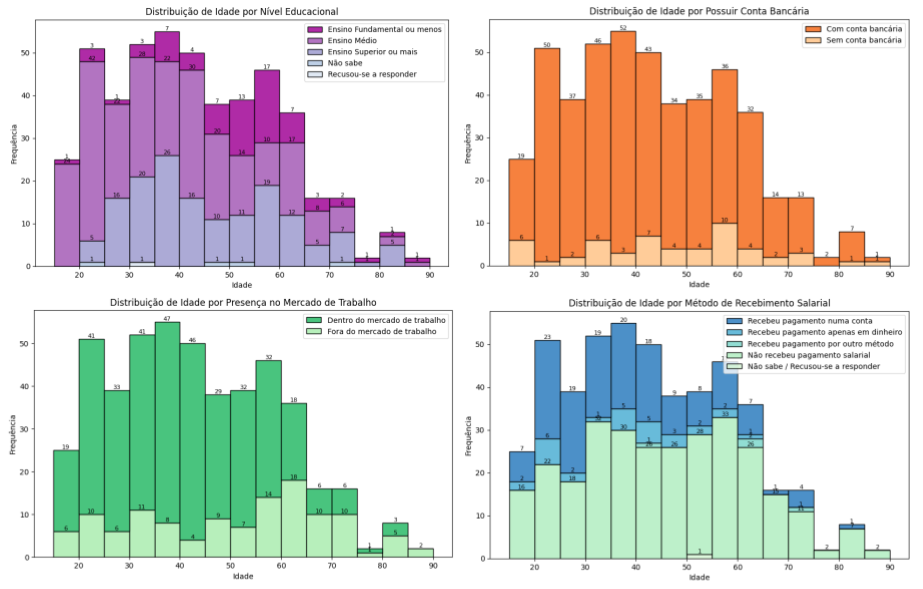
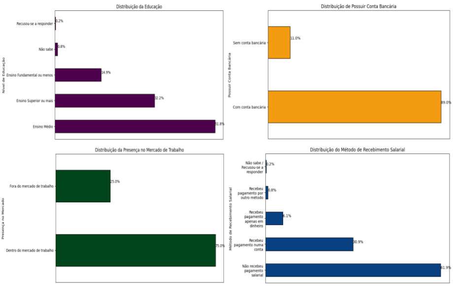
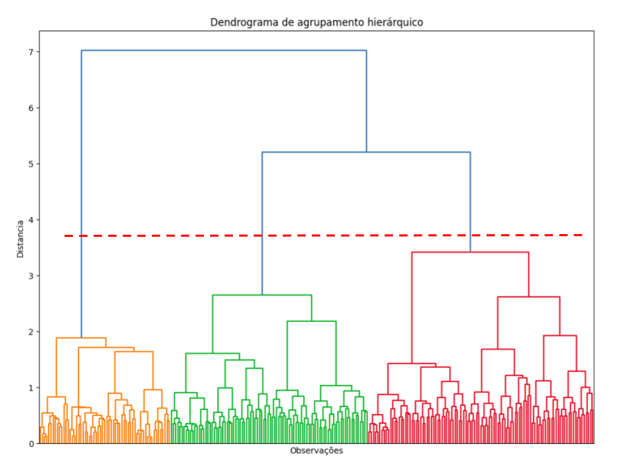
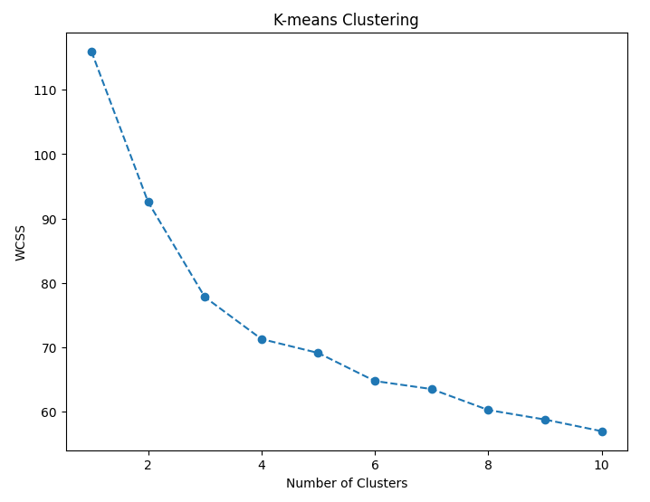
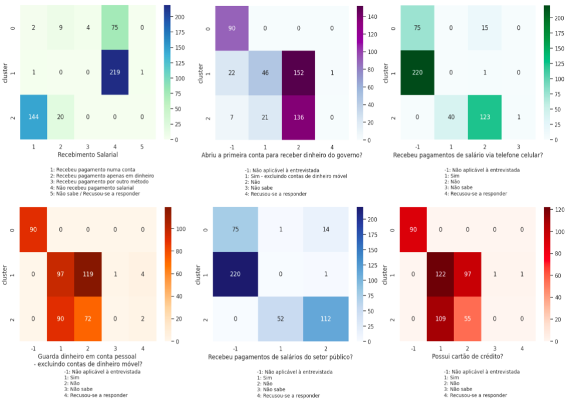

# Exploring women's financial inclusion: classification of women's profiles and related variables

Repository of final project for the USP/Esalq MBA in Data Science & Analytics – 2024.  

## 📖 Description

This project investigates **women's financial inclusion** as a crucial indicator of economic empowerment.  
The study used data from the **World Bank (Global Findex 2021)** to classify profiles of Brazilian women in relation to access to financial services, identifying patterns of inclusion, dependence on government assistance, and use of digital technologies.

## 🎯 Objectives

- Analyze socioeconomic and financial variables related to women's inclusion.
- Identify **profiles (clusters)** of financially included and excluded women.
- Provide **practical insights** for the formulation of public policies and market strategies aimed at female audiences.

## 🗂️ Data

- Source: **World Bank – Global Findex 2021**
- Granularity: **individual (Brazilian women)**  
- Sample: **475 observations** and **71 variables** initially  
- Treatments applied:
    - Exclusion of irrelevant variables or those with >60% null values
    - Imputation of missing data with averages or control values (-1)
    - Normalization and reduction of the final set to 67 variables  

## 🔎 Methodology
1. **Exploratory Data Analysis (EDA)**

    As can be seen in the figure below, which shows the distribution of variables by age, most of the women interviewed had a high school or college education. 
    In all age groups up to 84 years old, a large proportion of women remained in the labor market, decreasing as they got older. 
    However, 62% had not received a salary in the last 12 months. 
    Only 11% did not have any type of bank account.

      

    Analyzing only the distribution of socioeconomic variables, just over 51% of the women interviewed have a high school education and another significant portion (32%) have a college degree or higher. 
    Educational level did not appear to be a determining factor for financial inclusion, as 89% of them have some type of bank account (traditional or mobile), although only 75% of them are somehow present in the labor market.

    

2. **Clustering**  
   - **Hierarchical (dendrogram)** to identify number of groups  
   - **K-Means** validated by metrics **Silhouette**, **Davies-Bouldin** and **Calinski-Harabasz**  

    I chose to explore the data by applying the hierarchical clustering scheme, which iteratively merges clusters based on a dissimilarity metric (such as Euclidean distance) until all clusters form a single cluster. The result allowed me to identify three main clusters.

    

    In order to test the result, the non-hierarchical k-means scheme was applied. In this scheme, the data started in a single cluster, and the algorithm iteratively divided them into smaller clusters until a stopping criterion was reached. The number of clusters was verified using the elbow curve, which allowed us to choose a number of clusters such that adding another cluster would not provide a better model of the data, and also through validation metrics.

    

    Among the internal validation metrics is the Silhouette coefficient, which measures the suitability of each data point to the cluster to which it has been assigned. The higher and further away the coefficient is from zero, the better. Another metric is the Davies-Bouldin index, which is based on the idea that good clusters are those that have low variation within the cluster and high separation between clusters—the closer the value is to zero, the better.  The combination of cohesion and separation is the Calinski-Harabasz index, a measure of the similarity of an object to its own cluster (cohesion) compared to other clusters (separation). Here, cohesion is estimated based on the distances of the data points in a cluster to the cluster centroid, and separation is based on the distance of the cluster centroids to the global centroid—the higher the value, the better.

    | Number of clusters | Silhouette | Davies-Bouldin | Calinski-Harabasz |
    |:-:|:-:|:-:|:-:|
    | 2 | 0.2499 | 1.3755 | 127.3031 |
    | **3** | **0.1948** | **1.8959** | **115.6588** |
    | 4 | 0.1775 | 2.0672 |  98.4795 |
    
    

3. **Selection of the most important variables**  
   - Significant variables are understood to be those with the greatest variation in centroids, i.e., how the variable behaved in different clusters.
  
    | Variable     | Label | Note |
    |:-------------|:------|:-----|
    | age          | Age of the respondent | **Demographic and income information** |
    | educ         | Educational level of the respondent |  |
    | inc_q        | Household income quintile within the economy (Eurostat) |  |
    | emp_in       | The respondent is in the labor market. |  |
    | | | |
    | receive_wages| You have received a salary payment | **Received salary** |
    | fin33        | Received public sector salary payments |  |
    | fin34a       | Received salary payments into an account |  |
    | fin34b       | Received salary payments on a cell phone |  |
    | | | |
    | fin14_2      | Paid digitally for a purchase in a store for the first time after COVID-19 | **Used cell phone/Internet/card (debit or credit) to pay for purchase** |
    | fin14c_2     | Paid online for a purchase for the first time after COVID-19 |  |
    | | | |
    | fin1_1a      | Opened the first account to receive a salary payment | **Account owner** |
    | fin1_1b      | Opened the first account to receive money from the government |  |
    | fin4         | Used a debit card |  |
    | fin4a        | Used a debit card in a store |  |
    | fin5         | Used a cell phone or the Internet to access the account |  |
    | fin6         | Used a cell phone or the Internet to check account balance |  |
    | fin7         | She has a credit card |  |
    | fin8b        | Paid off the entire balance on the credit card |  |
    | fin9         | She made any deposits into the account |  |
    | fin9a        | Made deposits into the account two or more times per month |  |
    | fin10        | Made withdrawals from the account |  |
    | fin10a       | Made withdrawals from the account two or more times per month |  |
    | fin10b       | Used the account to store money |  |

## 📊 Results

**Three main clusters** have been identified:

- **Cluster 2 – Greater inclusion**  
  Younger women with higher education, in the labor market, greater access to banking and digital services.  

- **Cluster 1 – Intermediate inclusion**  
  Middle-aged women with traditional bank accounts but dependent on government transfers.  

- **Cluster 0 – Less inclusion**  
  Older women, with low use of financial services, few bank accounts, and no digital access.  

The figure shows the first six variables that most differentiate the clusters. These characteristics indicate significant differences in patterns of financial service use among the clusters analyzed.

## 📌 Conclusions

- Financial inclusion is crucial for **women's empowerment** and is linked to factors such as income, education, and digital access.  
- Public policies and market strategies should consider the different profiles identified, prioritizing the least included groups.  
- The analysis suggests **four main dimensions of measurement**:  
  1. Demographic and income information
  2. Salary receipt
  3. Use of digital media/cards
  4. Bank account ownership  

## 🛠️ Technologies used

  

## 👩🏻‍💻 Author

## 🔓 License

